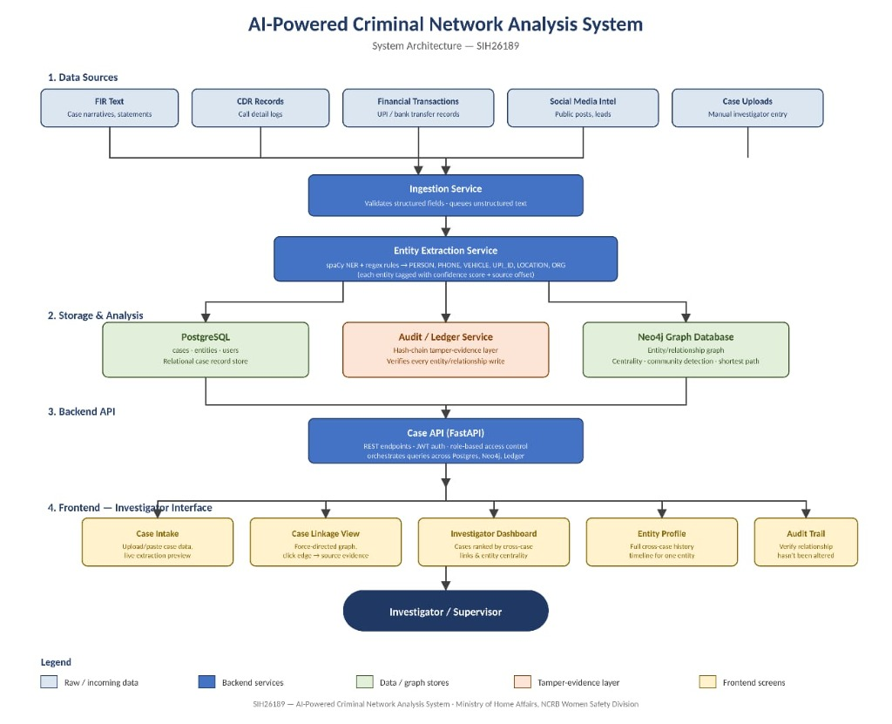

# CrimeLensAI — AI-Powered Criminal Network Analysis System

> **Smart India Hackathon 2026** · PS SIH26189 · Ministry of Home Affairs / NCRB Women Safety Division
> Theme: Blockchain & Cybersecurity · Category: Software

## Why This Exists

Every day, FIRs are filed across thousands of police stations in India — each recorded in isolation. A missing-person report in Lucknow, a suspicious financial transfer flagged in Hyderabad, and a vehicle seizure in Jaipur may all point to the same trafficking network, but no investigator ever sees the connection because the data lives in separate systems, separate districts, and separate officers' memories. When an officer transfers, their institutional knowledge leaves with them.

**CrimeLensAI** breaks this fragmentation. It ingests case data — FIR text, call records, financial transactions, location logs — extracts entities (people, phone numbers, vehicles, UPI IDs, locations) using NLP, links them across cases in a graph database, and surfaces hidden connections that look unrelated on paper but share a common suspect, vehicle, or financial trail. Every relationship the system discovers is backed by a tamper-evident, hash-chained audit record traceable to its exact source — making it admissible as real evidence, not just a data insight.

---

## Architecture

<!-- 
  Place your architecture diagram image in /docs/architecture-diagram/ 
  Recommended: Export as PNG from draw.io, Excalidraw, or Figma.
  Then update the path below.
-->



```
┌─────────────────────────────────────────────────────────────────────┐
│                        apps/web (React + Vite)                      │
│   Case Intake  ·  Investigator Dashboard  ·  Audit Trail Viewer     │
└──────────────────────────────┬──────────────────────────────────────┘
                               │ REST / JSON
                               ▼
┌──────────────────────────────────────────────────────────────────────┐
│                     services/api (Orchestration)                     │
│          Case CRUD · Search · Ingestion · Aggregation                │
│                        PostgreSQL datastore                          │
└────────┬─────────────────────┬─────────────────────┬────────────────┘
         │                     │                     │
         ▼                     ▼                     ▼
┌─────────────────┐  ┌─────────────────┐  ┌─────────────────┐
│ services/       │  │ services/       │  │ services/       │
│ extraction      │  │ graph           │  │ ledger          │
│ NLP + Entity    │  │ Neo4j + Cross-  │  │ Hash-Chain +    │
│ Resolution      │  │ Case Linkage    │  │ Auth + RBAC     │
└─────────────────┘  └─────────────────┘  └─────────────────┘
```

---

## Real-World Impact

| Before CrimeLensAI | After CrimeLensAI |
|---|---|
| Five missing-person FIRs filed in five districts — each treated as an isolated case | System flags that all five share a common phone number and vehicle registration — investigator sees a trafficking network, not five unrelated cases |
| When an SHO transfers, years of pattern knowledge walk out the door | Institutional memory lives in the graph — the next officer inherits every connection ever surfaced |
| Cross-district coordination requires manual phone calls and months of paperwork | Shared dashboard shows linked cases across jurisdictions in real time |
| "We found the connection" is an oral claim — inadmissible, untraceable | Every link is backed by a hash-chained audit record with source offsets — verifiable, tamper-evident, courtroom-ready |
| Financial trails across UPI IDs require forensic accountants and weeks of effort | Automated entity extraction flags shared UPI IDs across cases instantly |

---

## Tech Stack

| Layer | Technology | Purpose |
|---|---|---|
| **Frontend** | React 18, TypeScript, Tailwind CSS, Vite | Investigator-facing web UI |
| **Graph Visualization** | Cytoscape.js / react-force-graph | Interactive case-linkage network |
| **API Gateway** | Python, FastAPI | Orchestration & case management |
| **NLP / Extraction** | Python, spaCy, FastAPI | Entity extraction & resolution |
| **Graph Database** | Neo4j, Python, FastAPI | Cross-case linkage & network analysis |
| **Audit Ledger** | Python, FastAPI, hashlib | Hash-chain tamper-evidence & RBAC |
| **Relational DB** | PostgreSQL | Case, entity, and user storage |
| **Containerization** | Docker, Docker Compose | Local dev & independent deployment |
| **Mobile (Future)** | Capacitor | Wrap web app for Android/iOS |
| **Shared Types** | TypeScript + Python (Pydantic) | Cross-module API contract sync |

---

## Module Ownership

| Folder | Owner | Responsibility |
|---|---|---|
| `/services/extraction` | **Team Member 1** | NLP entity extraction, confidence scoring, fuzzy matching & entity resolution |
| `/services/graph` | **Team Member 2** | Neo4j graph operations, cross-case linkage, centrality & community detection |
| `/services/ledger` | **Team Member 3** | Hash-chain audit ledger, JWT auth, RBAC, privacy masking |
| `/services/api` | **Team Member 4** | Orchestration API, case CRUD, PostgreSQL models, service aggregation |
| `/apps/web` | **Team Member 5** | React frontend — Case Intake, Dashboard, Audit Trail screens |

> Update this table with actual names once team roles are assigned. See `CODEOWNERS` for the GitHub-enforced version.

---

## Local Setup

### Prerequisites

- [Docker](https://docs.docker.com/get-docker/) & [Docker Compose](https://docs.docker.com/compose/install/) v2+
- [Node.js](https://nodejs.org/) 20+ & npm (for frontend development)
- [Python](https://www.python.org/) 3.11+ (for backend development)
- Git

### One-Command Start

```bash
# Clone the repository
git clone https://github.com/<your-org>/CrimeLensAI.git
cd CrimeLensAI

# Copy example environment files
cp .env.example .env

# Start all services + databases
docker compose up --build
```

This brings up:

| Service | URL |
|---|---|
| Web Frontend | http://localhost:5173 |
| API Gateway | http://localhost:8000/docs |
| Extraction Service | http://localhost:8001/docs |
| Graph Service | http://localhost:8002/docs |
| Ledger Service | http://localhost:8003/docs |
| Neo4j Browser | http://localhost:7474 |
| PostgreSQL | localhost:5432 |

### Developing a Single Service

Each service can also run standalone:

```bash
# Example: Run extraction service locally
cd services/extraction
python -m venv .venv
source .venv/bin/activate  # Windows: .venv\Scripts\activate
pip install -r requirements.txt
uvicorn app.main:app --reload --port 8001
```

```bash
# Example: Run frontend locally
cd apps/web
npm install
npm run dev
```

---

## Git Workflow

### Branch Naming

```
feature/<module>/<short-description>
```

**Examples:**
- `feature/extraction/fuzzy-matching`
- `feature/graph/community-detection`
- `feature/ledger/hash-chain`
- `feature/api/case-crud`
- `feature/web/case-intake-ui`

### Where Does My Code Go?

Each team member works **almost entirely inside their own top-level folder**. This is by design — it minimizes merge conflicts when five people are working in parallel.

| If you own… | You work in… | You rarely touch… |
|---|---|---|
| Extraction | `/services/extraction/` | Anything outside it |
| Graph | `/services/graph/` | Anything outside it |
| Ledger | `/services/ledger/` | Anything outside it |
| API | `/services/api/` | Anything outside it |
| Web | `/apps/web/` | Anything outside it |

**Shared contracts** live in `/packages/shared-types/`. Changes here require team-wide review because they affect everyone's interfaces.

### API Contract First

Before coding, each service owner commits their OpenAPI spec to `/packages/shared-types/openapi/`. This locks the contract so:
- The frontend can build against stable response shapes
- Other services can integrate without waiting on implementation
- Shape renegotiation happens via PR, not Slack at 2 AM

### PR Flow

1. Branch off `develop` → `feature/<module>/<description>`
2. Work inside your module folder
3. Open PR into `develop` — CODEOWNERS auto-requests the right reviewer
4. After review + CI green → merge to `develop`
5. `main` is reserved for **stable, demo-ready** state only (merge from `develop` when the team agrees)

### CODEOWNERS

The `CODEOWNERS` file maps each folder to its owner. GitHub/GitLab will auto-assign the correct reviewer for every PR, so you never accidentally merge changes to a folder you don't own without the owner's sign-off.

---

## Future Scope

These are not aspirational features — they are a realistic institutional rollout path:

### Phase 2: CCTNS / NATGRID Integration
- Ingest live CCTNS case feeds via a standardized adapter
- Publish verified linkages back to NATGRID's intelligence layer
- Compliance with MHA data-sharing protocols and MeitY security standards

### Phase 3: Predictive Risk Scoring
- Train supervised models on historically linked cases to score new FIRs for linkage probability at intake
- Alert investigators proactively: "This new FIR shares 3 entities with a known trafficking cluster"

### Phase 4: Multilingual NER
- Extend spaCy pipelines to Hindi, Tamil, Telugu, Bengali, and Marathi FIR text
- Transliteration-aware entity resolution (e.g., matching "राजेश कुमार" to "Rajesh Kumar")

### Phase 5: Cross-State Deployment
- Federated deployment model: each state runs its own instance, cross-state queries routed through a central relay with consent-based data sharing
- Designed for India's federal policing structure — no single point of data centralization

---

## License

This project is developed as part of Smart India Hackathon 2026. License TBD based on MHA/NCRB deployment requirements.

---

<p align="center">
  <strong>CrimeLensAI</strong> · Built for investigators, not dashboards.
</p>
