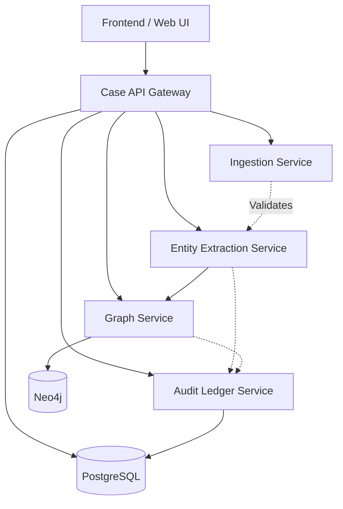

# CrimeLensAI - AI-Powered Criminal Network Analysis System

> **Smart India Hackathon 2026** · PS SIH26189 · Ministry of Home Affairs / NCRB Women Safety Division
> Theme: Blockchain & Cybersecurity · Category: Software

## Why This Exists
Every day, FIRs are filed across thousands of police stations in India - each recorded in isolation. CrimeLensAI breaks this fragmentation by ingesting case data, extracting entities (people, phone numbers, vehicles, UPI IDs, locations) using NLP, linking them across cases in a graph database, and surfacing hidden connections. Every relationship is backed by a tamper-evident, hash-chained audit record traceable to its exact source.

## Architecture



---

## Real-World Impact

| Before CrimeLensAI | After CrimeLensAI |
|---|---|
| Five missing-person FIRs filed in five districts — each treated as an isolated case | System flags that all five share a common phone number and vehicle registration — investigator sees a trafficking network, not five unrelated cases |
| When an SHO transfers, years of pattern knowledge walk out the door | Institutional memory lives in the graph — the next officer inherits every connection ever surfaced |
| Cross-district coordination requires manual phone calls and months of paperwork | Shared dashboard shows linked cases across jurisdictions in real time |
| "We found the connection" is an oral claim — inadmissible, untraceable | Every link is backed by a hash-chained audit record with source offsets — verifiable, tamper-evident, courtroom-ready |
| Financial trails across UPI IDs require forensic accountants and weeks of effort | Automated entity extraction flags shared UPI IDs across cases instantly |

---

## Tech Stack

| Layer | Technology | Purpose |
|---|---|---|
| **Frontend** | React 18, TypeScript, Tailwind CSS, Vite | Investigator-facing web UI |
| **Graph Visualization** | Cytoscape.js / react-force-graph | Interactive case-linkage network |
| **API Gateway** | Python, FastAPI | Orchestration & case management |
| **NLP / Extraction** | Python, spaCy, FastAPI | Entity extraction & resolution |
| **Graph Database** | Neo4j, Python, FastAPI | Cross-case linkage & network analysis |
| **Audit Ledger** | Python, FastAPI, hashlib | Hash-chain tamper-evidence & RBAC |
| **Relational DB** | PostgreSQL | Case, entity, and user storage |
| **Containerization** | Docker, Docker Compose | Local dev & independent deployment |
| **Shared Types** | TypeScript + Python (Pydantic) | Cross-module API contract sync |

---

## Module Ownership

> **IMPORTANT:** While specific members act as Leads for various modules, **ALL collaborators are eligible to write, access, and change code anywhere in this repository.**

| Folder | Lead | Responsibility |
|---|---|---|
| `/services/audit-ledger-service/` | **Member 1 (@reshmasri009)** | Hash-chain ledger, JWT auth, RBAC, privacy masking |
| `/services/case-api/`<br>`/services/ingestion-service/` | **Member 2 (@reshmasri009)** | Orchestration API, ingestion validation, PostgreSQL |
| `/services/entity-extraction-service/` | **Member 3 (@bharath0757)** | NLP entity extraction, fuzzy matching & resolution |
| `/services/graph-service/` | **Member 4 (@jithendar-guttula)** | Neo4j graph operations, cross-case linkage, analytics |
| `/frontend/` | **Member 5 (@avskrishna2-coder)** | React frontend - Case Intake, Dashboard, Audit Trail |

*Note: See `docs/team-ownership/OWNERSHIP.md` for complete details.*

---

## Local Setup

### Prerequisites

- [Docker](https://docs.docker.com/get-docker/) & [Docker Compose](https://docs.docker.com/compose/install/) v2+
- [Node.js](https://nodejs.org/) 20+ & npm (for frontend development)
- [Python](https://www.python.org/) 3.11+ (for backend development)
- Git

### One-Command Start

```bash
# Clone the repository
git clone https://github.com/<your-org>/CrimeLensAI.git
cd CrimeLensAI

# Copy example environment files
cp .env.example .env

# Start all services + databases
docker compose up --build
```

This brings up:

| Service | URL |
|---|---|
| Web Frontend | http://localhost:5173 |
| Case API Gateway | http://localhost:8000/docs |
| Extraction Service | http://localhost:8001/docs |
| Graph Service | http://localhost:8002/docs |
| Ledger Service | http://localhost:8003/docs |
| Ingestion Service | http://localhost:8004/docs |
| Neo4j Browser | http://localhost:7474 |
| PostgreSQL | localhost:5432 |

### Developing a Single Service

Each service can also run standalone:

```bash
# Example: Run extraction service locally
cd services/entity-extraction-service
python -m venv .venv
source .venv/bin/activate  # Windows: .venv\Scripts\activate
pip install -r requirements.txt
uvicorn app.main:app --reload --port 8001
```

```bash
# Example: Run frontend locally
cd frontend
npm install
npm run dev
```

---

## Git Workflow

### Branch Naming

```
feature/<module>/<short-description>
```

**Examples:**
- `feature/extraction/fuzzy-matching`
- `feature/graph/community-detection`
- `feature/ledger/hash-chain`
- `feature/api/case-crud`
- `feature/web/case-intake-ui`

### Shared Ownership & Contracts

Although we have Leads for different modules, **the repository is open to all collaborators**. You can fix bugs or add features in any folder. 

However, **shared contracts** live in `/contracts/`. Changes here require team-wide consensus because they affect everyone's interfaces.

### API Contract First

Before coding, ensure the OpenAPI spec in `/contracts/openapi/` is updated. This locks the contract so:
- The frontend can build against stable response shapes
- Other services can integrate without waiting on implementation

### PR Flow

1. Branch off `develop` 
2. Work on your feature
3. Open PR into `develop`
4. Anyone from the team can review and approve it!
5. `main` is reserved for **stable, demo-ready** state only.

---

## Future Scope

These are not aspirational features — they are a realistic institutional rollout path:

### Phase 2: CCTNS / NATGRID Integration
- Ingest live CCTNS case feeds via a standardized adapter
- Publish verified linkages back to NATGRID's intelligence layer
- Compliance with MHA data-sharing protocols and MeitY security standards

### Phase 3: Predictive Risk Scoring
- Train supervised models on historically linked cases to score new FIRs for linkage probability at intake
- Alert investigators proactively: "This new FIR shares 3 entities with a known trafficking cluster"

### Phase 4: Multilingual NER
- Extend spaCy pipelines to Hindi, Tamil, Telugu, Bengali, and Marathi FIR text

---

<p align="center">
  <strong>CrimeLensAI</strong> — Built for investigators, not dashboards.
</p>
